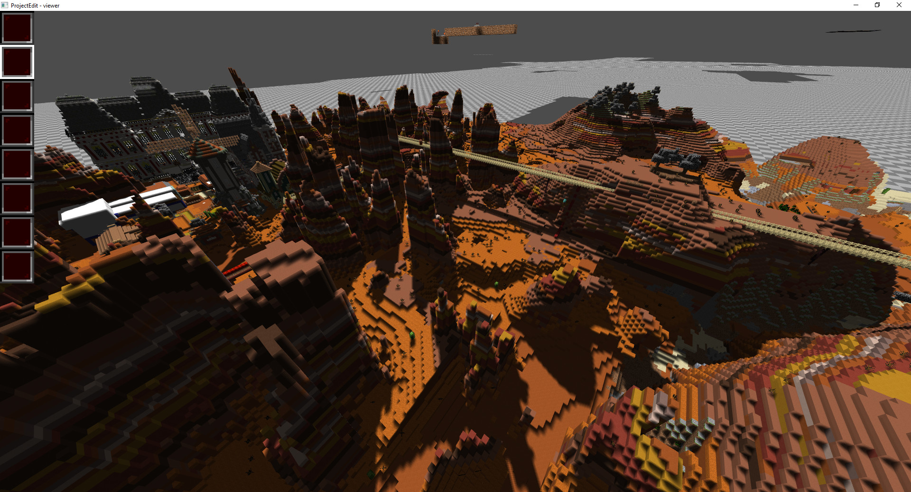

# ProjectEdit
A world editor for Minecraft

## Contributing
Please ensure that your commits are in the following style for PR's

https://www.conventionalcommits.org/en/v1.0.0/

### Type
Must be one of the following:

* **build**: Changes that affect the build system or external dependencies (example scopes: gulp, broccoli, npm)
* **ci**: Changes to our CI configuration files and scripts (example scopes: Travis, Circle, BrowserStack, SauceLabs)
* **docs**: Documentation only changes
* **feat**: A new feature
* **fix**: A bug fix
* **perf**: A code change that improves performance
* **refactor**: A code change that neither fixes a bug nor adds a feature
* **style**: Changes that do not affect the meaning of the code (white-space, formatting, missing semi-colons, etc)
* **test**: Adding missing tests or correcting existing tests

## Preview
